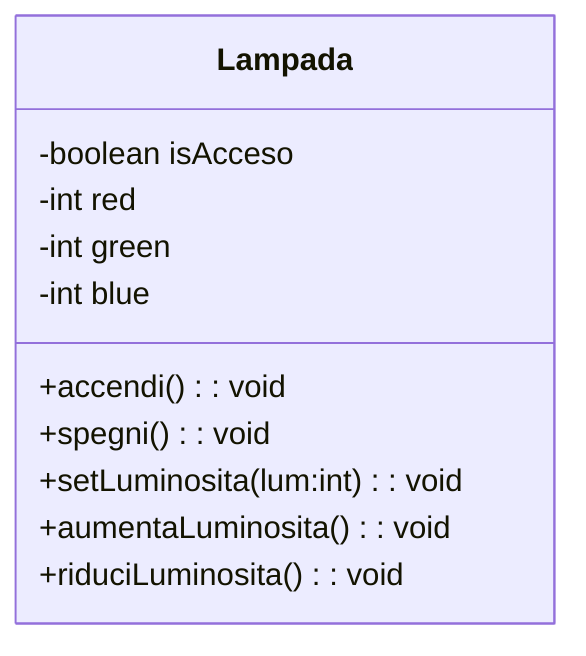

# 4Cinf progetto IoT

Progetto con il prof. Capobianco di Informatica, a.s. 2024/25.

La luminosità va da 0 a 100. In questo primo esempio, per luminosità 0, tutti i valori RGB devono essere a 0, per luminosità 100 tutti i valori devono essere a 100.

Esempio:

- setLuminosita(0)  -> red: 0, green: 0, blue:0 -> fill(0,0,0)
- setLuminosita(50)  -> red: 50, green: 50, blue:50 -> fill(128,128,128)
- setLuminosita(100)  -> red: 100, green: 100, blue:100 -> fill(255,255,255)
